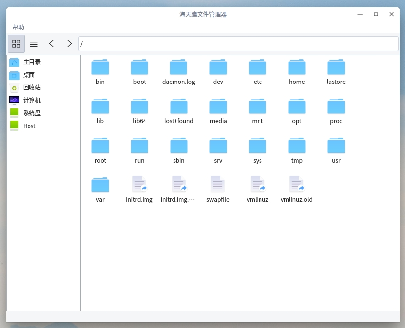
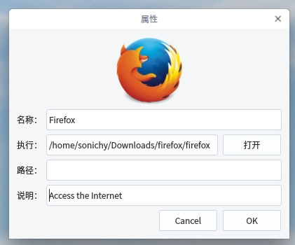

# Qt 海天鹰文件管理器
  
Linux 平台基于 Qt 的文件管理程序，文件操作需谨慎，个人软件仅供学习，若有损失概不负责。  
特色：一键创建desktop快捷方式，支持修改desktop属性。  
  
已知问题：无法获取挂载的分区，无法删除多个文件，无法删除非空的文件夹。  
已编译好的 HTYFileManager 程序适用64位Linux系统Qt5环境，双击运行，其他版本请自行编译。
