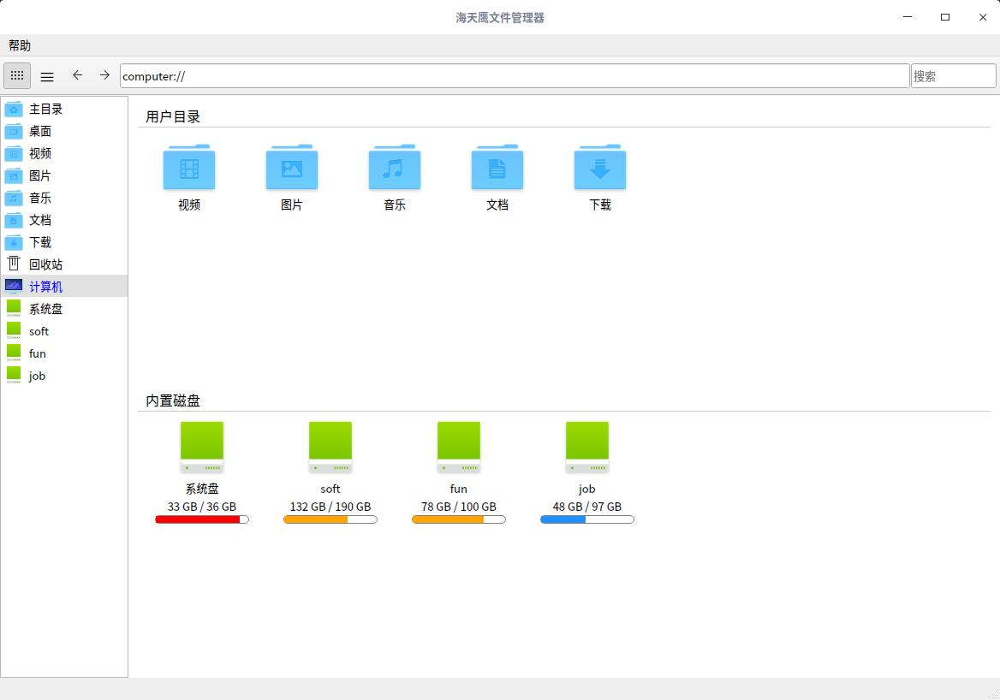
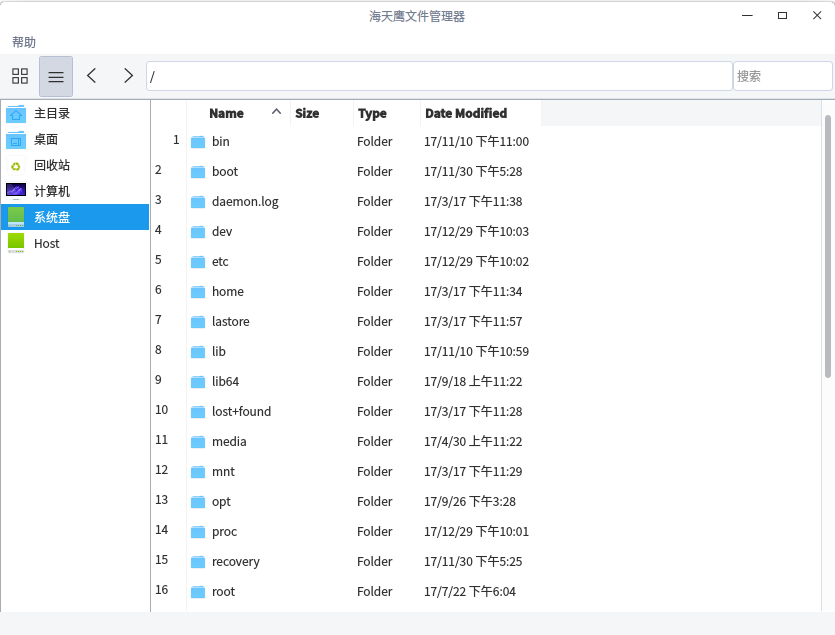

# Qt 海天鹰文件管理器
Linux 平台基于 Qt 的文件管理程序，文件操作需谨慎，个人软件仅供学习，若有损失概不负责。  
已编译好的 HTYFileManager 程序适用 64 位 Linux 系统 Qt5.7 环境，双击运行，其他版本请自行编译。  
install.sh 用于生成和复制 desktop 到用户目录，以便在启动菜单显示。
  
  

支持：文件右键菜单新增移动到、复制到、设为壁纸。  
已知问题：无法获取挂载的分区，无法删除多个文件，无法删除非空的文件夹。

### 支持MP3的ID3V1信息

### 支持一键创建 desktop 快捷方式和修改 desktop 属性。  

### 支持压缩和解压缩：
压缩功能需要安装 zip：sudo apt-get install zip  
解压缩功能需要安装 unzip：sudo apt-get install unzip